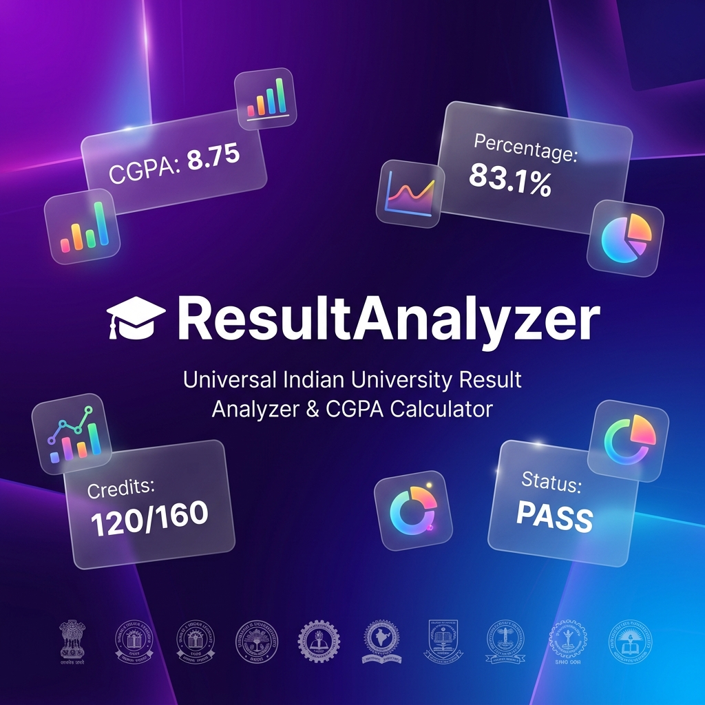
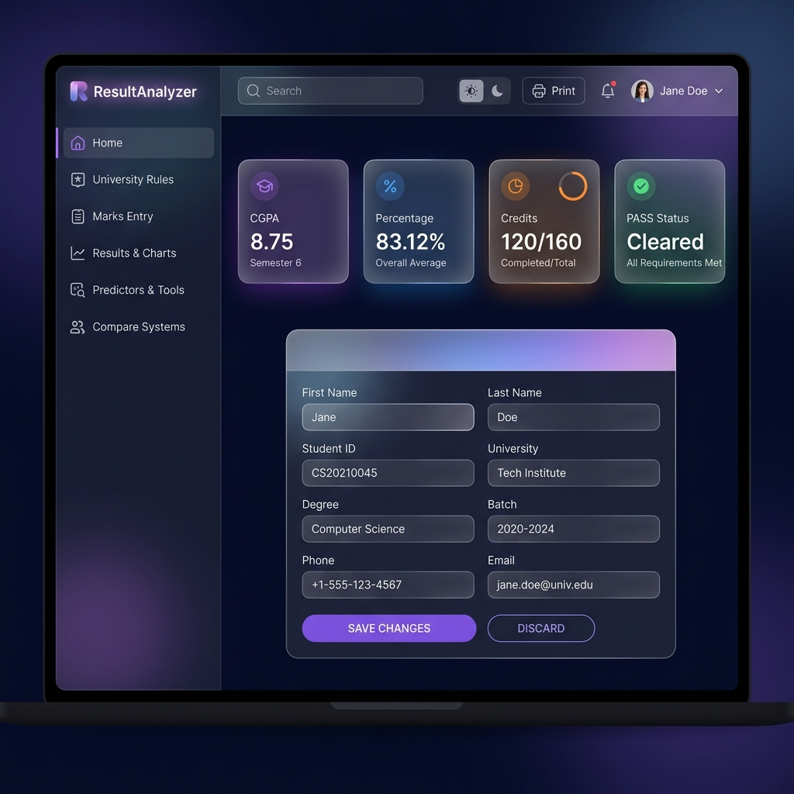
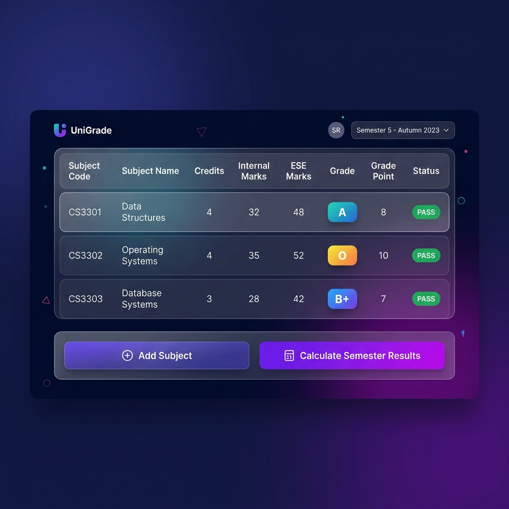
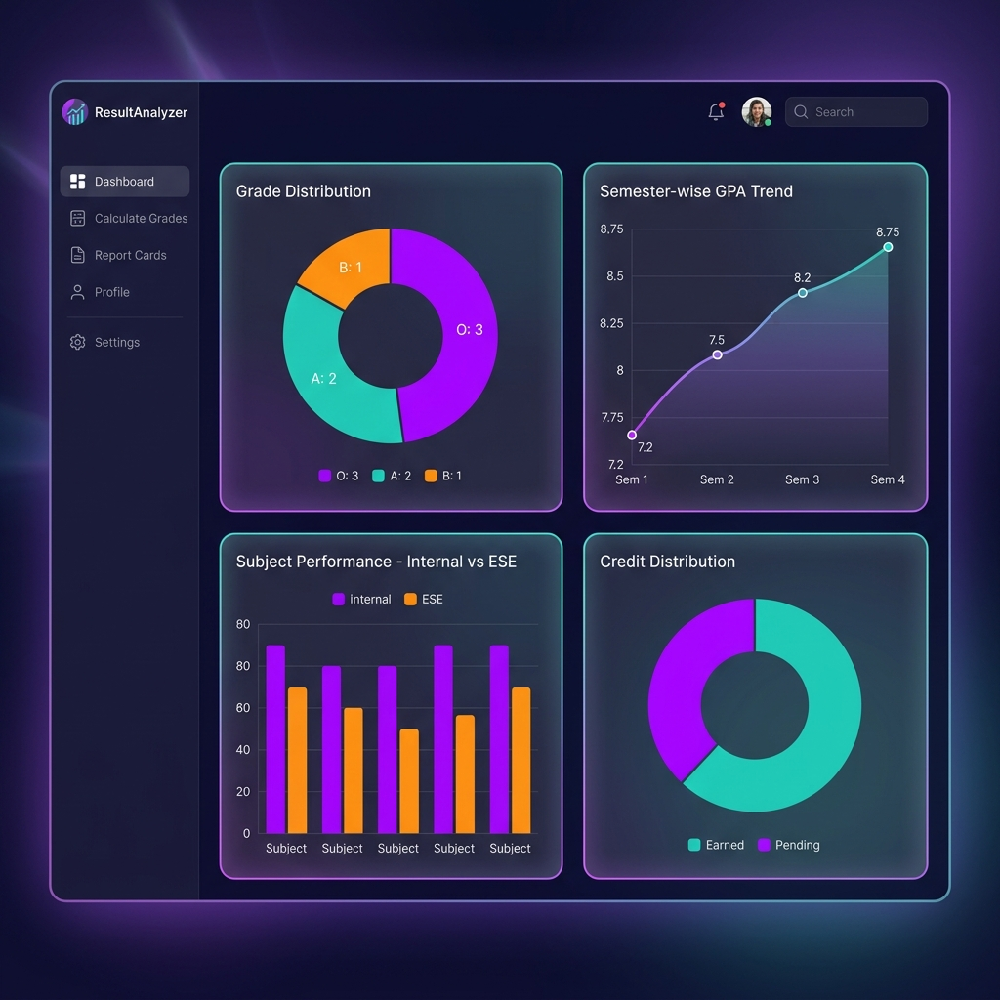
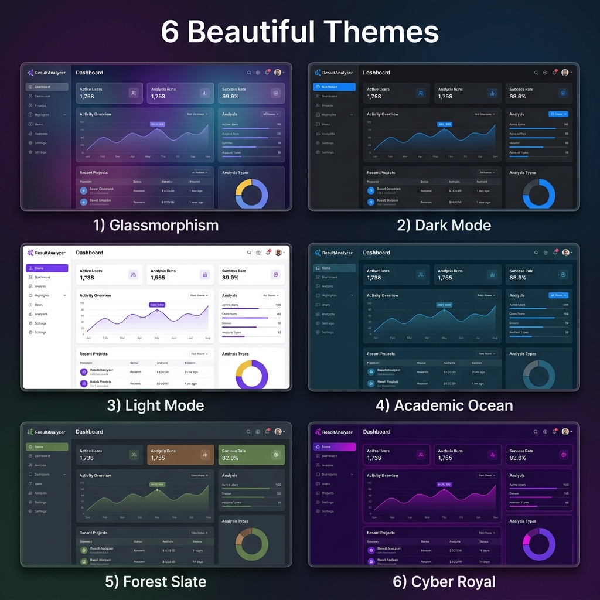
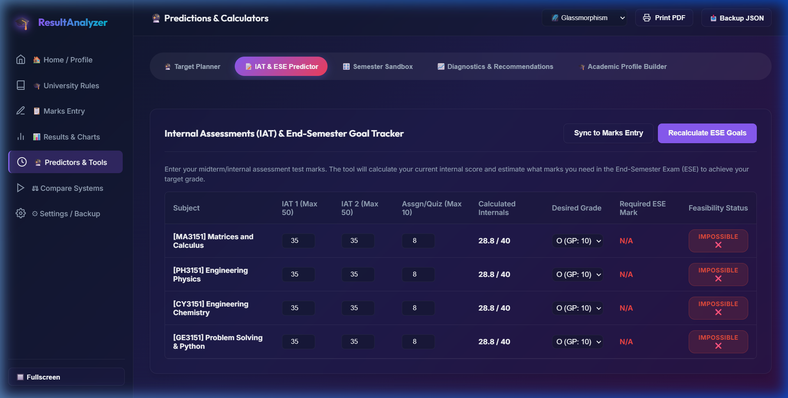
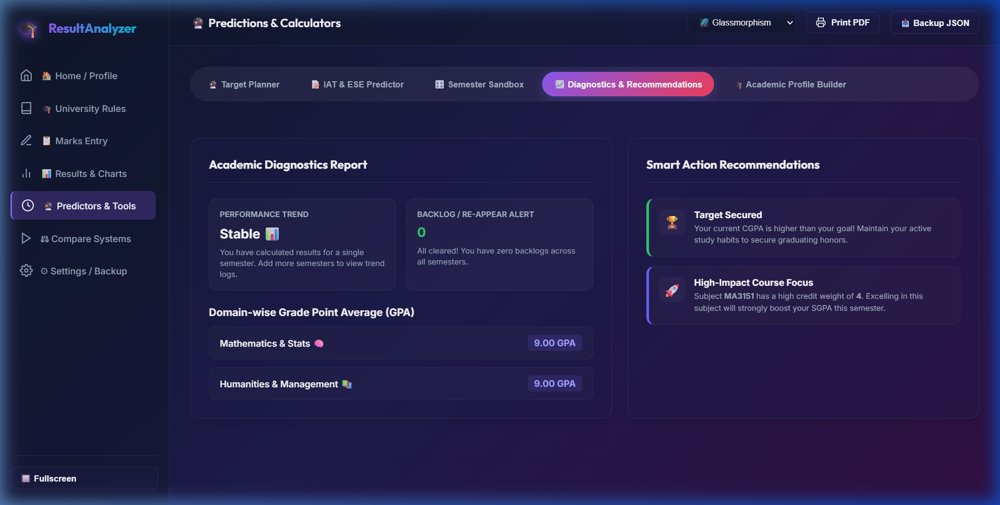
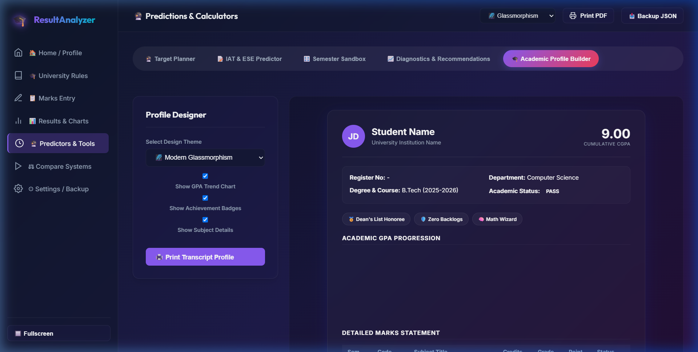

<div align="center">



<br>

# 🎓 ResultAnalyzer

### *Universal Indian University Result Analyzer & CGPA Calculator*

<br>

[](https://github.com/vijaymahes9080/mark-calculator-advanced-)
[](LICENSE)
[](https://html5.org)
[](https://www.w3.org/Style/CSS/)
[](https://javascript.com)

<br>

[](https://github.com/vijaymahes9080/mark-calculator-advanced-)
[](https://github.com/vijaymahes9080/mark-calculator-advanced-)
[](https://github.com/vijaymahes9080/mark-calculator-advanced-)
[](https://github.com/vijaymahes9080/mark-calculator-advanced-)

<br>

> **A comprehensive, offline-ready web application for Indian university students to calculate GPA, CGPA, percentages, and analyze academic performance across multiple semesters.**

</div>

---

## 🏠 Dashboard Preview



> *Home Dashboard with live CGPA tracking, student profile management, and instant stat cards — all wrapped in a stunning glassmorphism UI.*

---

## ✨ Features at a Glance

<table>
  <tr>
    <td align="center" width="180">
      <h2>🏛️</h2>
      <b>40+ Universities</b><br>
      Anna, Delhi, VIT, BITS & more
    </td>
    <td align="center" width="180">
      <h2>⚡</h2>
      <b>Real-Time Calc</b><br>
      GPA & CGPA update as you type
    </td>
    <td align="center" width="180">
      <h2>📈</h2>
      <b>Canvas Charts</b><br>
      Grade trends & comparisons
    </td>
    <td align="center" width="180">
      <h2>🎨</h2>
      <b>6 Themes</b><br>
      Glass, Dark, Ocean, Cyber & more
    </td>
  </tr>
  <tr>
    <td align="center" width="180">
      <h2>📱</h2>
      <b>Fully Responsive</b><br>
      Desktop, tablet & mobile ready
    </td>
    <td align="center" width="180">
      <h2>💾</h2>
      <b>100% Offline</b><br>
      No internet needed, LocalStorage
    </td>
    <td align="center" width="180">
      <h2>🔐</h2>
      <b>Privacy First</b><br>
      All data stays in your browser
    </td>
    <td align="center" width="180">
      <h2>📤</h2>
      <b>5 Export Formats</b><br>
      CSV, Excel, PDF, PNG, JSON
    </td>
  </tr>
</table>

---

## 📋 Marks Entry — Subject-wise Input



> *Enter subject codes, credits, internal marks & ESE scores. Status badges (✅ PASS / ❌ FAIL) update instantly. Filter, search, undo/redo — all built in.*

```
┌─────────────────────────────────────────────────────────────────┐
│ Subject Code │ Subject Name      │ Credits │ Int  │ ESE │ GP   │
├──────────────┼───────────────────┼─────────┼──────┼─────┼──────┤
│ CS3301       │ Data Structures   │    4    │  32  │  48 │  8   │
│ CS3302       │ Operating Systems │    4    │  35  │  52 │  9   │
│ CS3303       │ Database Systems  │    3    │  28  │  42 │  7   │
│ MA3151       │ Linear Algebra    │    4    │  34  │  46 │  8   │
└─────────────────────────────────────────────────────────────────┘
         ↓
   Semester GPA: 8.25  |  Credits Earned: 15/15  |  Status: PASS
```

---

## 📊 Analytics & Charts



> *Four interactive Canvas-rendered charts give you deep performance insights: grade spread, semester GPA trend, subject-wise comparison, and credit distribution.*

| Chart | Type | What It Shows |
|-------|------|----------------|
| 🥧 **Grade Distribution** | Doughnut | O, A+, A, B+, B, C grade spread |
| 📈 **GPA Trend** | Line Chart | Semester-wise GPA progression |
| 📊 **Subject Comparison** | Bar Chart | Internal vs ESE marks per subject |
| 🎯 **Credit Distribution** | Doughnut | Earned credits vs pending credits |

---

## 🎨 6 Beautiful Themes



> *Switch between 6 stunning themes instantly from the header dropdown — your preference is saved automatically.*

| Theme | Style | Best For |
|-------|-------|----------|
| 🌌 **Glassmorphism** | Frosted glass + blur effects | Premium modern look |
| 🌙 **Dark Mode** | Pure dark with electric accents | Night-time use |
| ☀️ **Light Mode** | Clean white, crisp UI | Daytime / printing |
| 🌊 **Academic Ocean** | Professional deep blue tones | Academic presentations |
| 🌲 **Forest Slate** | Nature-inspired dark greens | Calm focused study |
| 💜 **Cyber Royal** | Futuristic purple/violet | Style-forward vibe |

---

## 🔮 Smart Academic Suite & Predictor Tools

ResultAnalyzer Advanced now features an integrated **Smart Academic Suite** containing four professional-grade planning and forecasting tools.

### 📝 IAT Tracker & ESE Goal Predictor
Enter your mid-term internal marks (IAT 1, IAT 2, assignments) and calculate exactly what you need to score in your final End-Semester Exam (ESE) to achieve target grades (O, A+, A, etc.). Sync calculated internals back to the entry table with one click.
<p align="center">
  
</p>

### 🎛️ Semester Sandbox & GPA Simulator
Drag interactive sliders to simulate different grade marks. Lock specific courses and slide the *Target Semester GPA* to automatically distribute needed targets proportionally.

### 📈 Academic Diagnostics & Action Plan
Category domains auto-detect groups like Mathematics, CS & Coding, and Electrical subjects. Tracks multi-semester trends to give recommendations (e.g. recovery targets).
<p align="center">
  
</p>

### 🎓 Printable Academic Transcript Builder
Generates beautiful certificates with achievement badges (*Dean's List Honoree*, *Zero Backlogs*, *Code Commando*) and an embedded line graph showing GPA progression. Ready to print (PDF/Paper) using customized print CSS.
<p align="center">
  
</p>

In addition, the suite houses the following planning utilities:
* **🎯 CGPA Predictor & Target Planner**: Compute required GPA scores to hit graduation targets.
* **📅 Attendance & Shortage Tracker**: Input conducted/attended classes to track attendance percentages and view minimum class clearance counts.
* **📈 Grade Improvement Planner**: Evaluate the CGPA impact of replacing or upgrading specific subject grades.

---

## 🚀 Quick Start

```bash
# Clone the repository
git clone https://github.com/vijaymahes9080/mark-calculator-advanced-.git

# Navigate to project
cd mark-calculator-advanced-

# Open in browser (no server needed!)
start index.html          # Windows
open index.html           # macOS
xdg-open index.html       # Linux
```

> **No build step. No dependencies. No internet required. Just open and use!**

---

## 🏫 Supported Universities

<details>
<summary><b>🏛️ Central Universities (16)</b></summary>

| University | Location |
|------------|----------|
| Central University of Tamil Nadu | Tamil Nadu |
| University of Delhi | Delhi |
| Jawaharlal Nehru University | Delhi |
| Banaras Hindu University | Uttar Pradesh |
| Aligarh Muslim University | Uttar Pradesh |
| University of Hyderabad | Telangana |
| Pondicherry University | Puducherry |
| IGNOU | Delhi |
| Central University of Kerala | Kerala |
| Central University of Karnataka | Karnataka |
| Central University of Rajasthan | Rajasthan |
| Central University of Punjab | Punjab |
| Central University of Haryana | Haryana |
| Central University of Odisha | Odisha |
| Central University of Jammu | J&K |
| Visva-Bharati | West Bengal |

</details>

<details>
<summary><b>🏫 State Universities (21)</b></summary>

| University | State |
|------------|-------|
| Anna University | Tamil Nadu |
| Madras University | Tamil Nadu |
| Bharathiar University | Tamil Nadu |
| Bharathidasan University | Tamil Nadu |
| Alagappa University | Tamil Nadu |
| Periyar University | Tamil Nadu |
| Mother Teresa Women's University | Tamil Nadu |
| Manonmaniam Sundaranar University | Tamil Nadu |
| Tamil Nadu Open University | Tamil Nadu |
| Madurai Kamaraj University | Tamil Nadu |
| Annamalai University | Tamil Nadu |
| Calcutta University | West Bengal |
| Mumbai University | Maharashtra |
| Osmania University | Telangana |
| Andhra University | Andhra Pradesh |
| Kerala University | Kerala |
| Kannur University | Kerala |
| Lucknow University | Uttar Pradesh |
| Pune University | Maharashtra |
| Bangalore University | Karnataka |
| Mysore University | Karnataka |

</details>

<details>
<summary><b>🎓 Deemed & Autonomous (6)</b></summary>

| University | Location | Type |
|------------|----------|------|
| VIT University | Vellore, TN | Deemed |
| SRM Institute of Science and Technology | Chennai, TN | Deemed |
| Sathyabama Institute of Science and Technology | Chennai, TN | Deemed |
| Amrita Vishwa Vidyapeetham | Coimbatore, TN | Deemed |
| BITS Pilani | Pilani, Rajasthan | Deemed |
| SASTRA Deemed University | Thanjavur, TN | Deemed |

</details>

---

## 🏛️ University Grading Rules

| University | Regulation | Internal | External | Min ESE Pass | Total Pass |
|------------|------------|----------|----------|:------------:|:----------:|
| **Anna University** | R2025 | 50% | 50% | 40 | 50% |
| **Anna University** | R2021 | 40% | 60% | 45 | 50% |
| **Anna University** | R2017 | 20% | 80% | 45 | 50% |
| **Anna University** | R2013 | 20% | 80% | 45 | 50% |
| **Delhi University** | CBCS | 25% | 75% | 35 | 40% |
| **Madras University** | Standard | 25% | 75% | 40 | 50% |
| **VIT University** | Standard | 40% | 60% | 45 | 50% |
| **BITS Pilani** | Standard | 40% | 60% | 40 | 45% |

---

## ⚖️ University Comparison Tool

```
┌─────────────────────────────┬──────────────────┬──────────────────┐
│         Metric              │  Anna Univ R2021 │ Delhi Univ CBCS  │
├─────────────────────────────┼──────────────────┼──────────────────┤
│ Internal Weightage          │      40%         │      25%         │
│ External Weightage          │      60%         │      75%         │
│ Min External Pass Marks     │       45         │       35         │
│ Min Total Passing Mark      │      50%         │      40%         │
│ Grade Count                 │       7          │       9          │
│ Percentage Formula          │  CGPA × 9.5      │  (Obt/Max)×100  │
└─────────────────────────────┴──────────────────┴──────────────────┘
```

---

## 📤 Export Options

| Format | Description | Use Case |
|--------|-------------|----------|
| 📄 **CSV** | Subject-wise marks data | Spreadsheet import |
| 📊 **Excel (.xlsx)** | Full semester report | Official record keeping |
| 🖨️ **PDF / Print** | Complete analytics report | Submission / filing |
| 🖼️ **PNG** | Individual chart images | Presentations |
| 💾 **JSON** | Complete data backup | Data portability |

---

## ⌨️ Keyboard Shortcuts

| Shortcut | Action |
|----------|--------|
| `Ctrl + S` | 💾 Save student profile |
| `Ctrl + Z` | ↩ Undo last change |
| `Ctrl + Y` | ↪ Redo last change |
| `Ctrl + P` | 🖨️ Print report / PDF |

---

## 📁 Project Structure

```
mark-calculator-advanced/
│
├── 📄 index.html                    # Main application entry
├── 📄 composer.json                 # Composer details
│
├── 📂 assets/                       # App screenshots & images
│   ├── 🖼️ hero_banner.png
│   ├── 🖼️ dashboard_screenshot.png
│   ├── 🖼️ marks_entry_screenshot.png
│   ├── 🖼️ analytics_charts_screenshot.png
│   ├── 🖼️ themes_showcase.png
│   ├── 🖼️ predictors_mobile_screenshot.png
│   ├── 🖼️ iat_tracker_screenshot.png         # IAT tracker [NEW]
│   ├── 🖼️ diagnostics_screenshot.png         # Diagnostics engine [NEW]
│   ├── 🖼️ transcript_builder_screenshot.png  # Transcript builder [NEW]
│   └── 🖼️ profile_theme_screenshot.png       # Transcript theme preview [NEW]
│
├── 📂 css/
│   ├── 🎨 style.css                 # Core styling
│   ├── 🎨 themes.css                # 6 theme definitions
│   ├── 🎨 responsive.css            # Mobile responsiveness
│   └── 🎨 academic-suite.css        # Smart Suite styles [NEW]
│
└── 📂 js/
    ├── 💾 storage.js                # LocalStorage manager
    ├── ✅ validation.js             # Input validation
    ├── 📊 grade.js                  # Grading engine & presets
    ├── 🔢 calculator.js             # GPA/CGPA calculations
    ├── 📈 charts.js                 # Canvas chart rendering
    ├── 📤 export.js                 # CSV/Excel/PDF export
    ├── 🔮 academic-suite.js         # Smart Suite logic [NEW]
    └── 🚀 app.js                    # Main controller
```

---

## 🛠️ Built With

<p align="center">
  
  
  
  
  
</p>

---

## 📋 Browser Support

| Browser | Status |
|---------|--------|
| Chrome | ✅ Fully Supported |
| Firefox | ✅ Fully Supported |
| Safari | ✅ Fully Supported |
| Edge | ✅ Fully Supported |

---

## 🤝 Contributing

Contributions are welcome! Feel free to open issues or submit pull requests.

```bash
# Fork the repo
# Create your feature branch
git checkout -b feature/AmazingFeature

# Commit your changes
git commit -m 'Add some AmazingFeature'

# Push to the branch
git push origin feature/AmazingFeature

# Open a Pull Request
```

---

## 📄 License

This project is licensed under the **MIT License** - see the [LICENSE](LICENSE) file for details.

---

## 🙏 Acknowledgments

- Built for Indian university students struggling with complex grading systems
- Supports multiple regulations including Anna University R2013, R2017, R2021, R2025
- 100% offline - no data leaves your browser

---

<p align="center">
  
</p>

<p align="center">
  <b>⭐ Star this repo if you find it helpful!</b>
</p>
